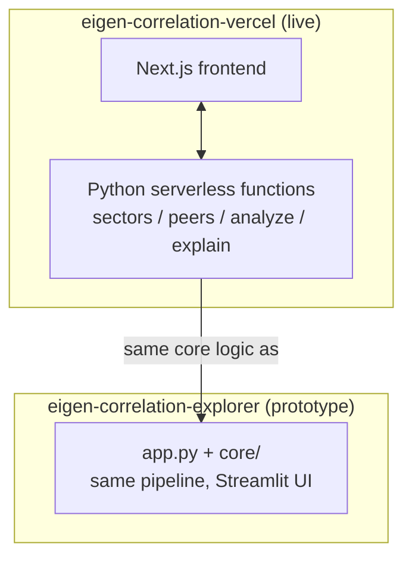

# EigenSight

Pick a stock → an AI layer figures out which sectors/themes it belongs to → AI proposes peer stocks in that sector, validated and ranked by live market cap → recent price history is pulled for the group → PCA / eigen-decomposition runs on daily returns → the app answers one direct question: **if this stock moves, does the rest of the group move with it — yes or no, and which way?**

**Live app:** [eigen-correlation-vercel.vercel.app](https://eigen-correlation-vercel.vercel.app/)

This repo holds two implementations of the same analysis pipeline, built in sequence:

| Folder | Stack | Status |
| --- | --- | --- |
| [`eigen-correlation-vercel/`](eigen-correlation-vercel) | Next.js + Python serverless functions on Vercel | **Live**, current version |
| [`eigen-correlation-explorer/eigen-correlation/`](eigen-correlation-explorer/eigen-correlation) | Streamlit | Original prototype |

## How it works

1. **Sector discovery** — given a ticker, an LLM (via OpenRouter) returns every sector/theme it plausibly belongs to, open-ended rather than picked from a fixed list (e.g. NVDA comes back as `["Semiconductors", "AI Infrastructure", "Data Center Hardware", "Graphics Processing Units"]`).
2. **Peer discovery** — for the chosen sector, the LLM proposes up to 20 candidate tickers. Every candidate is checked against yfinance: no market cap means the ticker doesn't resolve, so it's dropped. Survivors are ranked by live market cap.
3. **Price + market cap fetch** — yfinance, no key required.
4. **PCA / eigen-decomposition** — daily returns are centered and their covariance matrix eigen-decomposed via `eigh` (numerically correct for symmetric matrices).
5. **Relationship call** — for every peer, its correlation with the target ticker becomes a direct, deterministic Yes/No: `|correlation| >= 0.5` means "yes, real relationship" (direction from the sign); below that, "no reliable relationship." No AI involved in this step — it's the actual data, not a summary of it.
6. **AI explanation** — the relationship table plus each ticker's real % price change over the fetch window are sent to an LLM for a short, plain-English answer to "if this stock moves, does the rest of the group move with it?"

## Architecture

```mermaid
flowchart LR
    User["User enters a ticker"] --> Discovery["AI: sector discovery\n(OpenRouter)"]
    Discovery --> Peers["AI: peer discovery\n(OpenRouter)"]
    Peers --> Validate["yfinance\nvalidate + rank by market cap"]
    Validate --> Prices["yfinance\nfetch price history"]
    Prices --> PCA["PCA / eigen-decomposition\n(eigh on covariance matrix)"]
    PCA --> Rel["Relationship table\ncorrelation -> Yes/No + direction"]
    Rel --> Explain["AI explanation\n(OpenRouter)"]
    Explain --> Out["Rendered: relationship table,\nheatmap, price chart, loadings, AI writeup"]
```





See each folder's own README for implementation detail: [Vercel version](eigen-correlation-vercel/README.md) · [Streamlit version](eigen-correlation-explorer/eigen-correlation/README.md).

## Local development

**Vercel version** (the live one):
```bash
cd eigen-correlation-vercel
npm install
cp .env.example .env   # fill in OPENROUTER_API_KEY
npm run dev            # Python API routes need `vercel dev` instead
```

**Streamlit version**:
```bash
cd eigen-correlation-explorer/eigen-correlation
python3 -m venv venv && source venv/bin/activate   # Windows: venv\Scripts\activate
pip install -r requirements.txt
cp .env.example .env   # fill in OPENROUTER_API_KEY
streamlit run app.py
```
